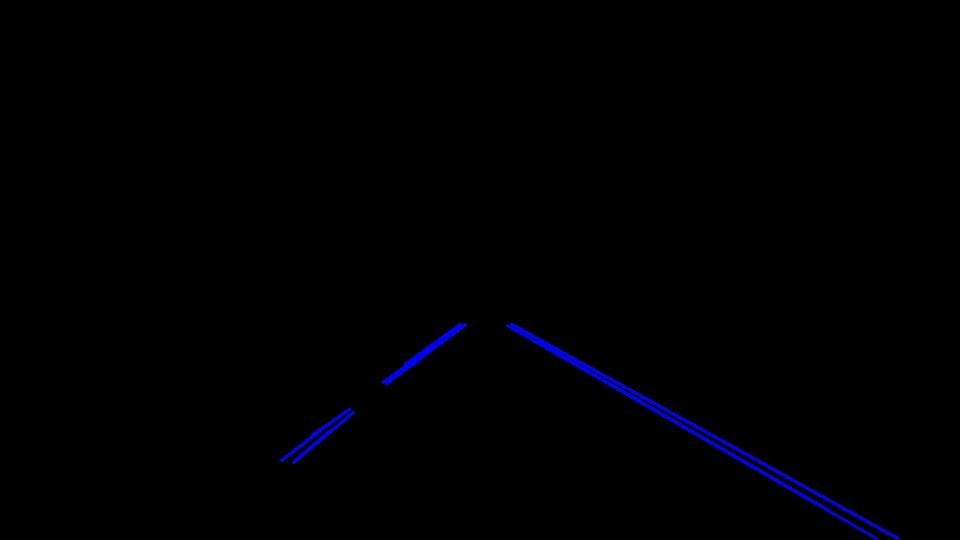
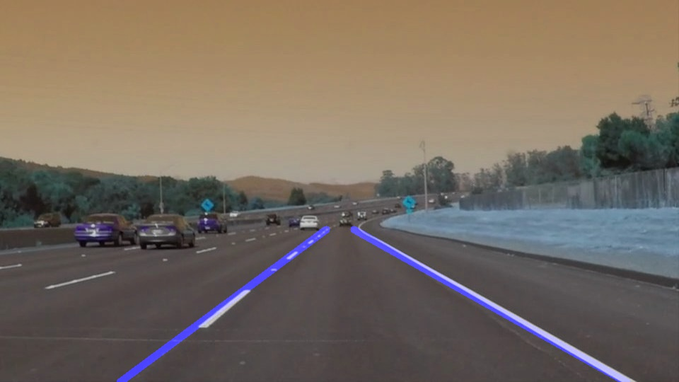

# **Finding Lane Lines on the Road**

## 1. PIPELINE DESCRIPTION

### MORE HELPER FUNCTIONS

1) **slope_and_intercept**- calculates the slope and intercept of all the line segments obtained after applying hough
transform.

2) **lane_classifier**- divides the line segments obtained from the hough transform into left and right lane based on
their slope value and sign. 
		
3) **extrapolate**- The input value LANE is sorted in ascending order according to the x-coordinate
of the lower end of a line. This function takes moving average of slope and intercept of the linesstarting from
the bottom most line.

**NOTE**- This method is better than just taking average of slope and intercept of all the line segments at once as it decreases
the effect of an outlier line which is not a part of the lane, if so.

### PIPELINE 

My Pipeline consisted of 5 broad steps.

#### 1) Pre-processing the image
a) converting the image to **GRAYSCALE** to detect edges using gradient method. Fine tuning of
the threshold values was done to detect appropriate line segments.
b) next step was to use some gaussain filters like GAUSSAIN BLUR. It basically decreases the gradient between any two points which makes it easier to detect lanes because now lanes' edges will be those points which still have high gradient.
		
#### 2) Edge Detection
Next step was to detect the edges using **Canny Edge detector** which works on two threshold values- low and high. It calculates the gradient between neighbouring points and decides according to the threshold values.

#### 3) Obtaining Line Segments
After obtaining edges in the form of pixel values, hough transform was applied. Fine tuning of parameters like min. line length, max line gap was done. 

#### 4) Classification into two lanes
Based on the slope values of the line segments, they were divided into left and right lane. Negative for left lane and positive for right lane. Any horizontal or vertical lines were excluded.

### 2. Shortcomings with the current pipeline

One shortcoming is faced while detecting lanes with lesser radius of curvature i.e having more curvature. In this case, the line segment drawn covers only a portion of the actual lane. Another shortcoming is presented when an image, with an intensity significantly more than the regular images, is encountered. 

### 3. Possible Improvements

For more curved lane lines, the region of interest can be divided into multiple parts and same method as above applied to each part. Finally, lane lines obtained from each part can be connected end to end.

A condition for excessive or low intensity of light in an image can be created. That is, if an image has excessive intensity,
threshold values for canny edge detection should be changed accordingly.
